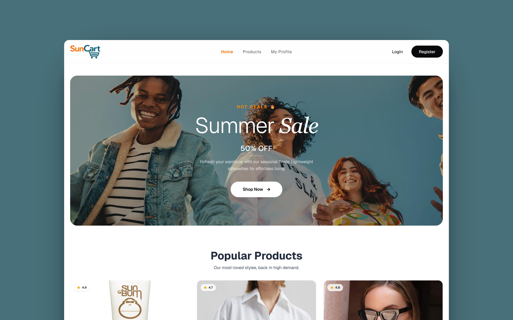

# ☀️ SunCart

A modern eCommerce application for discovering and purchasing summer essentials, including sunglasses, fashion items, skincare products, beach accessories, and more.

**Built with Next.js, MongoDB, Better Auth, Tailwind CSS, and DaisyUI.**

[](https://suncart-nextjs.vercel.app/)
 
[](https://mdsajuahmed.com)
 
[](https://linkedin.com/in/mdsajuahmed)

---

## 🔗 Demo

🌐 **Live Site:** https://suncart-nextjs.vercel.app

---

## 📸 Screenshot

[](https://suncart-nextjs.vercel.app/)

---

## ✨ Features

|     | Feature                          | Description                                                                    |
| --- | -------------------------------- | ------------------------------------------------------------------------------ |
| 🛍️ | Product Catalog                  | Browse and discover summer essentials across multiple categories               |
| 🔍  | Product Details                  | View detailed product information including pricing, descriptions, and images  |
| 🔐  | Authentication System            | Create accounts, sign in securely, and access protected content                |
| 👤  | User Dashboard                   | Manage profile information and account settings                                |
| ❤️  | Personalized Shopping Experience | Access user-specific functionality after authentication                        |
| 🚫  | Protected Routes                 | Restrict access to private pages and product details for unauthenticated users |


---

## 🛠️ Technologies Used

### Frontend

* Next.js (App Router)
* React.js
* Tailwind CSS
* DaisyUI

### Backend & Database

* MongoDB

### Authentication

* Better Auth

### Deployment

* Vercel

---

## 🎯 Project Highlights

- Built a full-stack eCommerce application using Next.js App Router
- Implemented secure authentication and session management with Better Auth
- Integrated MongoDB for persistent data storage
- Developed protected routes and authenticated user flows
- Leveraged server-side rendering and modern Next.js features
- Structured the application using scalable component-based architecture

---

## 🚀 Getting Started

### Prerequisites

* Node.js
* npm

### Installation

```bash
git clone https://github.com/md-saju-ahmed/suncart-nextjs.git

cd suncart-nextjs

npm install
```

### Run Development Server

```bash
npm run dev
```

Open:

```text
http://localhost:3000
```

### Production Build

```bash
npm run build
```

### Start Production Server

```bash
npm start
```

---

## 🎯 Purpose

SunCart was created to simulate a real-world eCommerce workflow, focusing on authentication-based shopping experiences, scalable application architecture, and modern web development practices using Next.js.

---

## 📄 License

This project is licensed under the MIT License.
